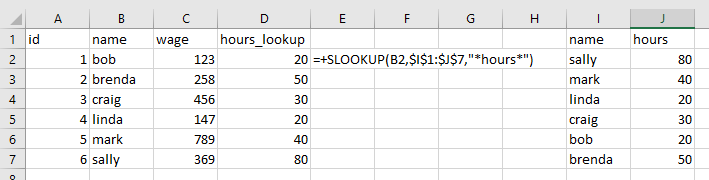

# XLops

Utility functions for Excel/VBA.

# Modules

`FunDates`: Functions for parsing dates.

`FunLogic`: Boolean functions for common scenarios.

`FunLookup`: Simplified variations of `*LOOKUP()`/`*MATCH()` functions.

`FunText`: Functions for parsing text.

# Installation
1. Save this repo to a desired directory.

1. In Developer Mode, import the individual `Fun*.bas` files under the *src* folder as modules.

1. *(Optional)* Import `RegXLops.bas` as a module and run its subroutine to have tooltips for the imported functions.